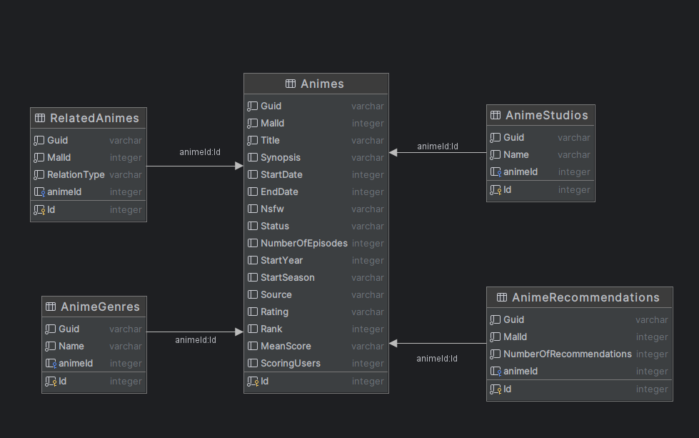

# MyAnimeList Anime Database

---

- Containing 27817 animes per 6 October 2024
- All data obtained using [MyAnimeList API (beta ver.) (2)](https://myanimelist.net/apiconfig/references/api/v2)

## Database Schema

---

Notes:

- MalId is Id from [MyAnimeList.net](https://myanimelist.net)
- Id and Guid is generated automatically and doesn't related with [MyAnimeList.net](https://myanimelist.net)
- Might contain duplicate or incomplete data, please consider to clean and verify by yourself
